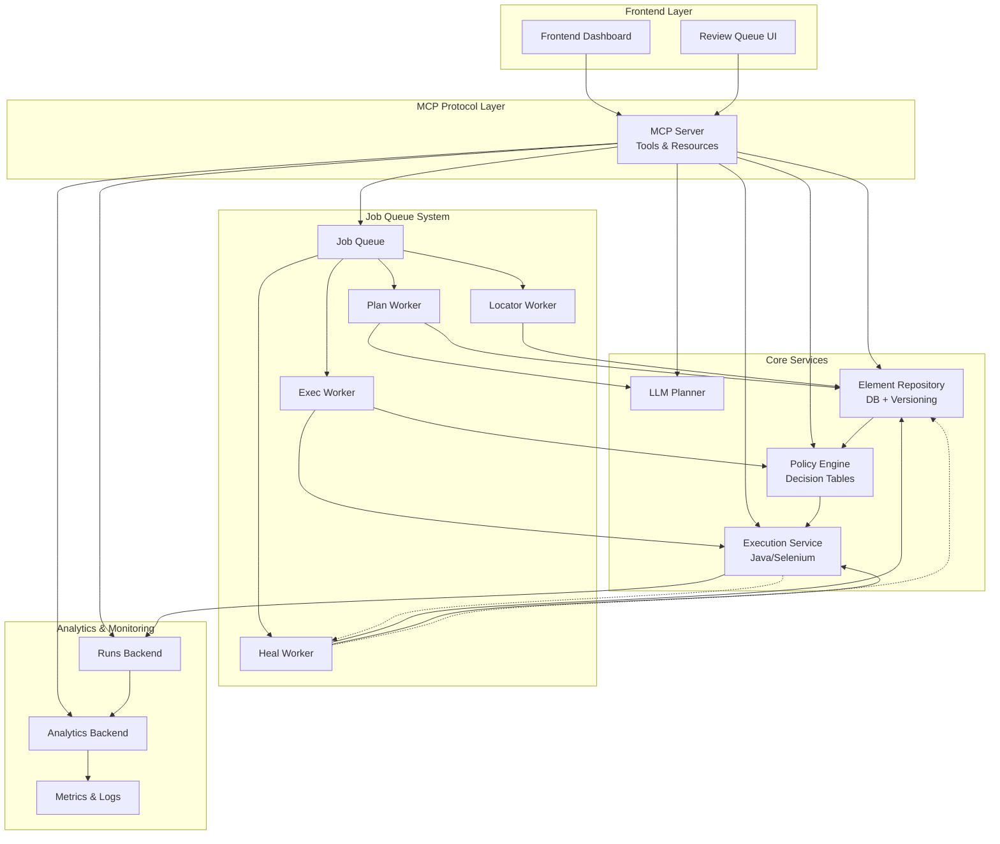

# Platform Architecture

## System Architecture Diagram

## Component Responsibilities

### MCP Server
- **Tool Interface**: Standardized contracts for all platform operations
- **Resource Management**: Element repository, test data, analytics access
- **Protocol Compliance**: Full MCP specification implementation
- **Authentication**: RBAC integration and audit logging

### Element Repository
- **Versioned Storage**: Git-like versioning for locator changes
- **Human Approval**: Review workflow for AI-generated locators
- **Conflict Resolution**: Merge strategies for concurrent updates
- **Performance**: Sub-100ms lookup for execution-critical paths

### Policy Engine
- **Runtime Branching**: Dynamic test path selection based on page conditions
- **Decision Tables**: Configurable business rules (seating_mode, user_type, etc.)
- **Context Evaluation**: Real-time page state assessment
- **Fallback Logic**: Graceful degradation strategies

### Execution Service
- **Browser Orchestration**: Multi-browser Selenium grid management  
- **Action Execution**: Atomic test step execution with retry logic
- **State Management**: Session persistence and cleanup
- **Failure Detection**: Smart outcome classification and healing triggers

### Job Queue System
- **Task Orchestration**: Async processing for plan/exec/heal operations
- **Priority Management**: SLA-based queue prioritization
- **Backpressure**: Load shedding and circuit breaker patterns
- **Idempotency**: Safe retry mechanisms for all operations