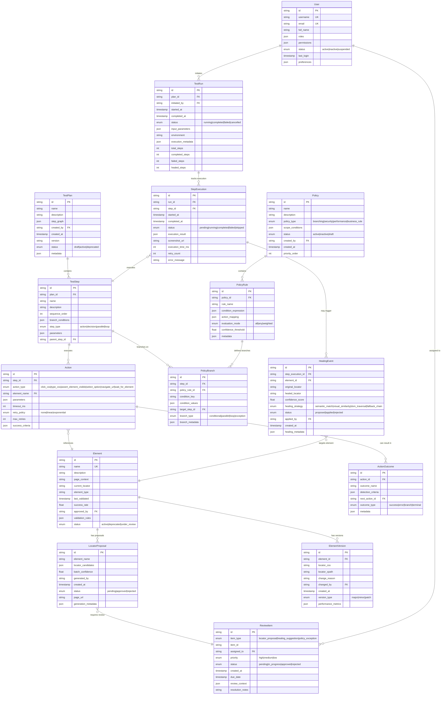

# Data Models & Entity Relationships

## Entity Relationship Diagram

## Key Data Model Patterns

### Step Graph Structure
TestPlans use a directed acyclic graph (DAG) representation where:
- Each TestStep can have multiple child steps (parallel execution)
- PolicyBranch entries define conditional routing between steps
- Loop constructs supported via step references with iteration limits

### Element Versioning Strategy  
- **Semantic Versioning**: Major (breaking selector changes), Minor (new fallbacks), Patch (performance optimizations)
- **Approval Workflow**: LocatorProposal → ReviewItem → ElementVersion → Element update
- **Rollback Support**: Previous versions retained with performance metrics for intelligent fallback

### Healing Event Chain
1. Action fails → HealingEvent created with proposed locator
2. Confidence score determines auto-apply threshold (>0.9) vs. human review
3. Applied healings create new ElementVersion with healing metadata
4. Success/failure feedback updates healing algorithm confidence

### Multi-Outcome Actions
Actions support multiple defined outcomes via ActionOutcome entities:
- Each outcome has detection criteria (DOM changes, URL patterns, error messages)
- Outcomes can chain to different next actions, enabling complex branching logic
- Terminal outcomes end execution branch, success outcomes continue main flow