# Sequence Diagrams

## A) "Run AI" Locator Generation

```mermaid
sequenceDiagram
    participant U as User
    participant FE as Frontend
    participant MCP as MCP Server  
    participant LW as Locator Worker
    participant ER as Element Repository
    participant RQ as Review Queue
    
    U->>FE: Upload element names list
    FE->>MCP: bulk_generate_locators(names, page_context)
    MCP->>LW: Queue locator generation job
    
    loop For each element name
        LW->>LW: Analyze page context & name
        LW->>LW: Generate selector candidates
        LW->>LW: Score confidence & priority
    end
    
    LW->>ER: Save proposals as pending
    
    alt High confidence batch (>0.9)
        LW->>ER: Auto-approve low-risk proposals  
        LW->>MCP: Return approved locators
    else Requires review
        LW->>RQ: Create review items
        LW->>MCP: Return pending status
        MCP->>FE: Show review required
        
        U->>RQ: Review proposals
        U->>RQ: Approve/Reject/Modify
        RQ->>ER: Save approved elements
        RQ->>FE: Notify completion
    end
    
    MCP->>FE: Return generation results
    FE->>U: Display approved elements
```

## B) Prompt → Plan → Execute

## C) Self-Healing on Failure

## D) Test Evolution - New Action Insertion

## Key Sequence Patterns

### Confidence-Based Automation
- **High confidence (>0.9)**: Auto-approve/apply with audit logging
- **Medium confidence (0.7-0.9)**: Apply with deferred review queue
- **Low confidence (<0.7)**: Block for immediate human review

### Scoped Fallback Strategy
1. **Primary locator**: Current approved element locator
2. **Page-scoped**: Alternative selectors for same page context  
3. **Section-scoped**: Selectors that work across similar page sections
4. **Global fallback**: Generic selectors as last resort
5. **Manual escalation**: Human review when all automated options exhausted

### Review Queue Prioritization
- **Urgent**: Blocking execution failures, security violations
- **High**: New element approvals, healing validations  
- **Medium**: Plan optimizations, performance improvements
- **Low**: Deferred healings, analytics reviews

### Idempotency & State Management
- All MCP tool calls include correlation IDs for duplicate detection
- Execution state checkpointed at each step for resume capability
- Review items track approval state to prevent double-processing
- Healing events record application status to avoid re-healing